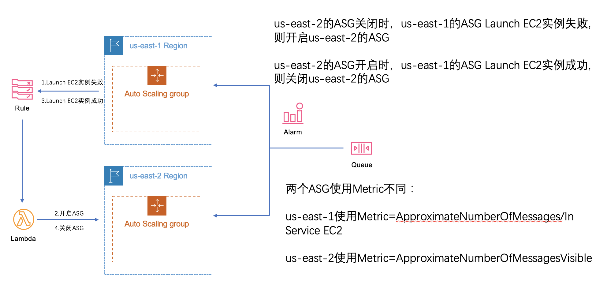
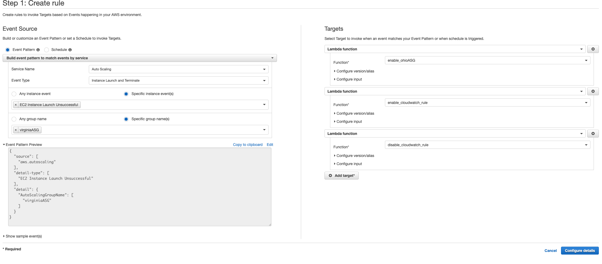

# 跨Region Launch spot解决方案

## 免责声明

建议测试过程中使用此方案，生产环境使用请自行考虑评估。

当您对方案需要进一步的沟通和反馈后，可以联系 nwcd_labs@nwcdcloud.cn 获得更进一步的支持。

欢迎联系参与方案共建和提交方案需求, 也欢迎在 github 项目 issue 中留言反馈 bugs。

---

当一个region的spot实例不足导致无法启动spot EC2实例时，启动临近region的EC2 spot实例，从而达到最佳性价比。本文假设使用region为Virginia，利用AWS跨region是骨干网的特性，在Virginia不能启动G4dn.xlarge实例时，从Ohio启动G4dn.xlarge实例。当Virginia的G4dn.xlarge实例有库存后，再逐渐将用量切回Virginia。

## 架构图



在us-east-1和us-east-2分别创建2个auto scaling group，分别名为virginiaASG和ohioASG。当us-east-1扩展spot G4失败时，触发lambda，将us-east-2的ASG扩展策略开启。默认生产环境在us-east-1的ASG，配置Cloudwatch rule当us-east-1的ASG中EC2实例启动失败，则通过lambda启动us-east-2上的ASG，并且关闭原有监测EC2实例启动失败的Cloudwatch rule，启动监测us-east-1的ASG中EC2启动成功的Cloudwatch Rule。当检测到us-east-1的ASG启动EC2实例成功，则通过Cloudwatch Rule关闭us-east-2的ASG，并且关闭原有监测EC2实例启动成功的Cloudwatch rule，启动监测us-east-1的ASG中EC2启动失败的Cloudwatch Rule。us-east-1 ASG使用更为精准的Metric，使用SQS的ApproximateNumberOfMessages值，除以ASG中In Service EC2数量，计算出每台EC2最佳处理任务的数量，使用target tracking scaling policy，使每台EC2处理任务保持最佳。us-east-2 ASG使用approximatenumberofmessagesvisible作为metric。

### 创建ASG用的Metric

us-east-1使用自定义Metric，根据官方文档https://docs.aws.amazon.com/zh_cn/autoscaling/ec2/userguide/as-using-sqs-queue.html，在使用SQS队列作为Metric，target tracking scaling作为策略时，建议使用每台EC2的处理任务数量作为Metric，获取方式如下：
使用 SQS获取队列属性 (https://docs.aws.amazon.com/cli/latest/reference/sqs/get-queue-attributes.html)命令获取在队列中等待的消息数 (ApproximateNumberOfMessages)
```
aws sqs get-queue-attributes --queue-url https://sqs.region.amazonaws.com/123456789/MyQueue \
--attribute-names ApproximateNumberOfMessages
```

使用 describe-auto-scaling-groups (https://docs.aws.amazon.com/cli/latest/reference/autoscaling/describe-auto-scaling-groups.html) 命令获取组的运行容量，这是处于 InService 生命周期状态的实例数。此命令返回 Auto Scaling 组的实例及其生命周期状态。
```
aws autoscaling describe-auto-scaling-groups --auto-scaling-group-names my-asg

```

通过将可从队列中检索的消息的大概数量除以队列的运行容量，计算每个实例的任务数量。按照 1 分钟的粒度将结果发布为 CloudWatch 自定义指标。以下是示例将指标数据分析 (https://docs.aws.amazon.com/cli/latest/reference/cloudwatch/put-metric-data.html)命令。
```
aws cloudwatch put-metric-data --metric-name MyBacklogPerInstance --namespace MyNamespace \
--unit None --value 20 —dimensions MyOptionalMetricDimensionName=MyOptionalMetricDimensionValue

```

us-east-2使用approximatenumberofmessagesvisible作为metric，用如下命令获取，同样适用put-metric-data上传：
```
aws sqs get-queue-attributes --queue-url https://sqs.region.amazonaws.com/123456789/MyQueue \
--attribute-names ApproximateNumberOfMessagesvisile

```
### 创建ASG
我们假设每台EC2实例最佳处理任务数是20，同时预估us-east-1的ASG大约200台EC2实例规模。那么可以将us-east-1的ASG target tracking scaling自定义指标设置为20，将us-east-2的target tracking scaling自定义指标设置为200。由于target tracking scaling自定义的指标的ASG只能用命令行创建，参考：https://docs.aws.amazon.com/zh_cn/autoscaling/ec2/userguide/as-scaling-target-tracking.html#target-tracking-policy-creating-aws-cli

### 创建lambda：
将repo中的enable_ohio.py,disable_ohio.py,enable_rule.py,disable_rule.py分别创建为lambda funtion。

### 创建Cloudwatch rule：
如下图，当virginiaASG的EC2实例启动失败时，运行启动ohioASG的lambda，并且关闭当前cloudwatch rule，开启监控virginiaASG的EC2实例启动成功的cloudwatch rule。

反之，再创建一遍。


部署完成。

## 减少SPOT造成中断
因为SPOT实例中断前2分钟会有通知，所以我们可以提前两分钟让实例不再获取任务进行处理，等待关机。这里有分为两种情况，在EC2实例内部署代码检测，或在EC2实例外部署代码检测。我们将分别提供例子代码：

* 在EC2实例内部署代码检测
```
#!/bin/bash

TOKEN=`curl -s -X PUT "http://169.254.169.254/latest/api/token" -H "X-aws-ec2-metadata-token-ttl-seconds: 21600"`

while sleep 5; do

    HTTP_CODE=$(curl -H "X-aws-ec2-metadata-token: $TOKEN" -s -w %{http_code} -o /dev/null http://169.254.169.254/latest/meta-data/spot/instance-action)

    if [[ "$HTTP_CODE" -eq 401 ]] ; then
        echo 'Refreshing Authentication Token'
        TOKEN=`curl -s -X PUT "http://169.254.169.254/latest/api/token" -H "X-aws-ec2-metadata-token-ttl-seconds: 30"`
    elif [[ "$HTTP_CODE" -eq 200 ]] ; then
        # Insert Your Code to Handle Interruption Here
    else
        echo 'Not Interrupted'
    fi

done
```

这段代码先检索了Instance Metadata Service访问令牌，然后使用令牌从Instance Metadata Service确认实例是否会中断。如2分钟后会被中断，会得到HTTP 200的返回，如不中断会返回404。返回200可以插入一些代码，去停止这台实例获取新任务。

* 在EC2实例外部署代码检测
可以参看repo中的spot-monitor.py文件，将本文件放到lambda中，使用EventBridge的SPOT实例interruption触发lambda，可以将send_notifications()替换为发现2分钟内会中断想执行的任务。
```
import schedule
import time
import requests


def check_job():
    is_marked = requests.get('http://169.254.169.254/latest/meta-data/spot/termination-time')
    if is_marked.status_code != 404:
        send_notifications()


def send_notifications():
    print("SEND MESSAGE TO SNS") # Insert Your Code to Handle Interruption Here
  


if __name__ == "__main__":
    schedule.every(10).seconds.do(check_job)
    while True:
        schedule.run_pending()
        time.sleep(1)


def lambda_handler(event, context):
    """
    :param event: interruption acton Event send to AWS EventBridge which triggered AWS lambda 
    :param context: AWS Lambda runtime context
    :return: the json like info includes the instance id and the termination time,
    """
    # TODO implement
    info = "INSTANCE IS RUNNING AS EXPECTED"
    if event["detail"]["instance-action"] == "terminate":
        info = {
            "instance-id": event["detail"]["instance-id"],
            "instance_action": event["detail"]["instance_action"],
            "termination_time": event["time"]
        }
        send_notifications()

    return {
        'statusCode': 200,
        'body': json.dumps(info)
    }
```

## ASG Scale-in 时避免正处理任务的SPOT被回收
参看以下示例代码(decrement-capacity.py)，将此代码融合进业务代码，当实例持续30秒没有接收到新的任务，则运行以下代码，实例将自行关闭，并且Desired Capacity值减1，实现Scale-in。

```
import json
import boto3

ec2_client = boto3.client('ec2')
asg_client = boto3.client('autoscaling')

def lambda_handler(event, context):
    """
    :param event: SNS message triggered event
    :param context: AWS Lambda runtime context
    :return: the json like info includes the instance id and the termination time,
    """
    msg = event['Records'][0]['Sns']['Message']
    msg_json = json.loads(msg)
    id = msg_json['Trigger']['Dimensions'][0]['value']
    print("Instance id is " + str(id))

    # get the the instance info
    response = ec2_client.describe_instances(
        Filters=[
            {
                'Name': 'instance-id',
                'Values': [str(id)]
            },
        ],
    )

    # print the ASG name 
    tags = response['Reservations'][0]['Instances'][0]['Tags']
    autoscaling_name = next(t["Value"] for t in tags if t["Key"] == "aws:autoscaling:groupName")
    print("Autoscaling name is - " + str(autoscaling_name))

    response = asg_client.client.terminate_instance_in_auto_scaling_group(
        InstanceIds=[
            str(id),
        ],
        AutoScalingGroupName=str(autoscaling_name),
        ShouldDecrementDesiredCapacity=True
    )
```
